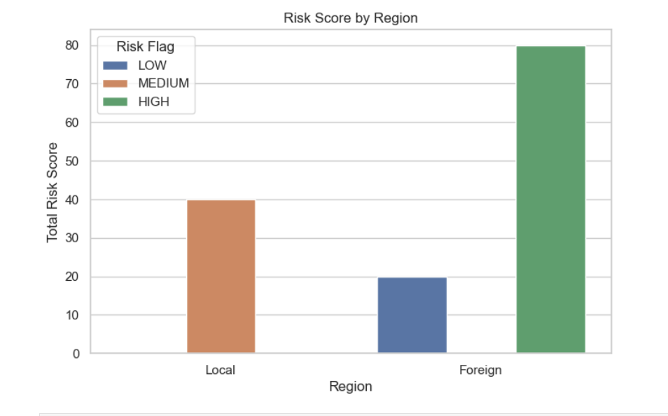

# Fraud Pattern Explanation Dashboard (Bank-Style)

## Overview
This project demonstrates a **fraud detection dashboard** for banking transactions. It flags suspicious transactions, provides AI-generated explanations, and visualizes trends and risk patterns using Python and SQLite.

The project is designed for **beginner to intermediate data engineers** and is **portfolio-ready**.

---

## Features
- Detects high, medium, and low-risk transactions
- Generates **plain-English explanations** for anomalies
- Visualizes:
  - High-risk transactions by region
  - Transaction frequency over time
  - Risk score distribution by transaction amount
- Fully Python-based with optional Power BI integration

---


## Tech Stack
- **Python**: pandas, matplotlib, seaborn, plotly
- **SQLite**: database for transactions
- **Simulated AI**: generates explanations for anomalies

---

## Getting Started

### 1. Clone the Repository
```bash
git clone https://github.com/Nicholus22/Fraud_Detection
cd fraud-dashboard
